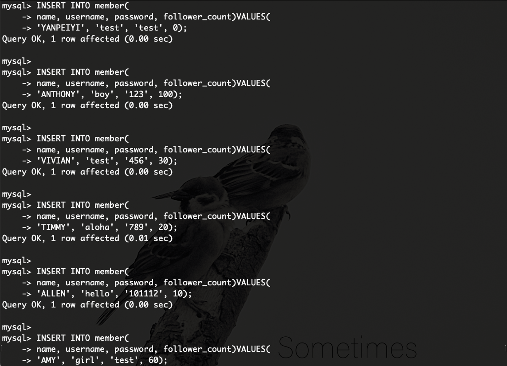

# Assignment - Week 5

### 要求三：SQL CRUD

1. 使⽤INSERT指令新增⼀筆資料到member資料表中，這筆資料的username和password欄位必須是test。接著繼續新增⾄少4筆隨意的資料。

    >👀 執行畫面
    

    >💻 SQL指令
    >```sql
    >INSERT INTO member(
    >name, username, password, follower_count)VALUES(
    >'YANPEIYI', 'test', 'test', 0);
    >
    >INSERT INTO member(
    >name, username, password, follower_count)VALUES(
    >'ANTHONY', 'boy', '123', 100);
    >
    >INSERT INTO member(
    >name, username, password, follower_count)VALUES(
    >'VIVIAN', 'test', '456', 30);
    >
    >INSERT INTO member(
    >name, username, password, follower_count)VALUES(
    >'TIMMY', 'aloha', '789', 20);
    >
    >INSERT INTO member(
    >name, username, password, follower_count)VALUES(
    >'ALLEN', 'hello', '101112', 10);
    >
    >INSERT INTO member(
    >name, username, password, follower_count)VALUES(
    >'AMY', 'girl', 'test', 60);
    >```
* * *
2. 使⽤ SELECT 指令取得所有在 member 資料表中的會員資料。

    >👀 執行畫面
    

    >💻 SQL指令
    >```sql
    >SELECT * FROM member;
    >```
* * *
3. 使⽤ SELECT 指令取得所有在 member 資料表中的會員資料，並按照 time 欄位，由
近到遠排序。

    >👀 執行畫面
    

    >💻 SQL指令
    >```sql
    >SELECT * FROM member
    >ORDER BY time ASC;
    >```
* * *
4. 使⽤ SELECT 指令取得 member 資料表中第 2 ~ 4 共三筆資料，並按照 time 欄位，由近到遠排序。 ( 並非編號 2、3、4 的資料，⽽是排序後的第 2 ~ 4 筆資料 )

    >👀 執行畫面
    

    >💻 SQL指令
    >```sql
    >SELECT * FROM member 
    >ORDER BY time  ASC
    >LIMIT 1, 3;
    >```
* * *
5. 使⽤ SELECT 指令取得欄位 username 是 test 的會員資料。

    >👀 執行畫面
    

    >💻 SQL指令
    >```sql
    >SELECT * FROM member 
    >WHERE username='test';
    >```
* * *
6. 使⽤ SELECT 指令取得欄位 username 是 test、且欄位 password 也是 test 的資料。

    >👀 執行畫面
    

    >💻 SQL指令
    >```sql
    >SELECT * FROM member 
    >WHERE username='test' and password='test';
    >```
* * *
7. 使⽤ UPDATE 指令更新欄位 username 是 test 的會員資料，將資料中的 name 欄位改成 test2。

    >👀 執行畫面
    

    >💻 SQL指令
    >```sql
    >UPDATE member
    >SET
    >name='test2'
    >WHERE username='test';  
    >```

### 要求四：SQL Aggregate Functions

1. 取得 member 資料表中，總共有幾筆資料 ( 幾位會員 )。
    >👀 執行畫面
    

    >💻 SQL指令
    >```sql
    >SELECT COUNT(*) FROM member;
    >```
* * *
2. 取得 member 資料表中，所有會員 follower_count 欄位的總和。
    >👀 執行畫面
    

    >💻 SQL指令
    >```sql
    >SELECT SUM(follower_count) FROM member;
    >```
* * *
3. 取得 member 資料表中，所有會員 follower_count 欄位的平均數。
    >👀 執行畫面
    

    >💻 SQL指令
    >```sql
    >SELECT AVG(follower_count) FROM member;
    >```
### 要求五：SQL JOIN (Optional)

1. 使⽤ SELECT 搭配 JOIN 語法，取得所有留⾔，結果須包含留⾔者會員的姓名。
    >👀 執行畫面
    

    >💻 SQL指令
    >```sql
    >SELECT member.name, message.content
    >FROM member 
    >INNER JOIN message 
    >ON member.id=message.member_id;
    >```
* * *
2. 使⽤ SELECT 搭配 JOIN 語法，取得 member 資料表中欄位 username 是 test 的所有留⾔，資料中須包含留⾔者會員的姓名。
    >👀 執行畫面
    

    >💻 SQL指令
    >```sql
    >SELECT member.name, message.content
    >FROM member 
    >INNER JOIN message 
    >ON member.id=message.member_id
    >WHERE username='test';
    >```
* * *
3. 使⽤ SELECT、SQL Aggregate Functions 搭配 JOIN 語法，取得 member 資料表中欄位 username 是 test 的所有留⾔平均按讚數。
    >👀 執行畫面
    

    >💻 SQL指令
    >```sql
    >SELECT AVG(message.like_count)
    >FROM member 
    >INNER JOIN message 
    >ON member.id=message.member_id
    >WHERE username='test';
    >```
* * *